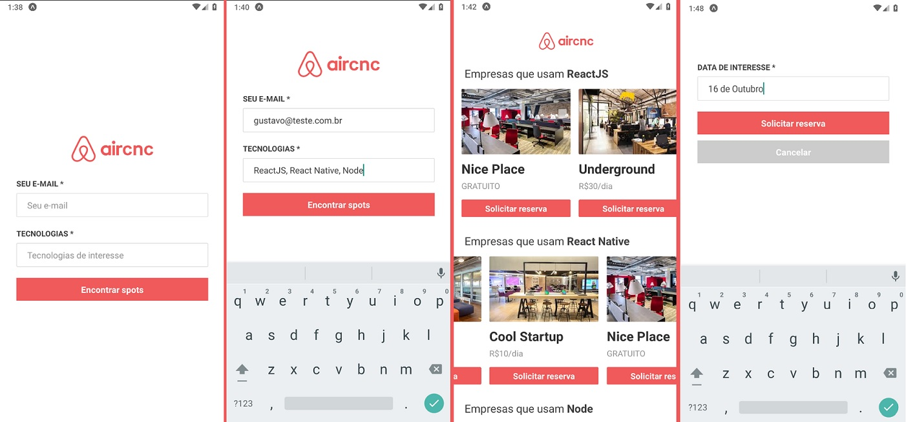

<h1 align="center">Aircnc (Code and Coffee) Mobile - Omnistack 09 🚀</h1>

<h3 align="center">
Application that helps people connect to companies that are making the rental of physical places and the whole structure so that they can use and work with affordable values.
</h3>

<h6 align="center">
This project is an application developed in React, React Native and Node.js produced in a course taught by Rocketseat.
<br>
Aircnc is a custom clone that aims to apply the knowledge and technologies used in the market.
<br>
</h6>

<h3 align="center"> First of all, you must run the backend and frontend application: <a href="https://github.com/Ganvs/aircnc-backend">aircnc_backend</a>, <a href="https://github.com/Ganvs/aircnc-frontend">aircnc_frontend</a> </h3>



<br>

## How to install

You need <a href="https://yarnpkg.com/lang/en/">Yarn</a> to this project.
<br>
Go to the folder with the command prompt and run:

```sh
yarn install
```

## How to use

Open your emulator, go to the project main folder with the command prompt and run:

```sh
yarn start
```

###### Important to know

This application was tested using an android emulator (genymotion).

You will need to install the <a href="https://expo.io/">expo client</a> application on your device.

When running the project will be opened in the browser a site with adynamic ip for connection (example: exp: //192.168.1.1: 19000)
You will need to change it in the backend, frontend and mobile project to work and sync with your device.
